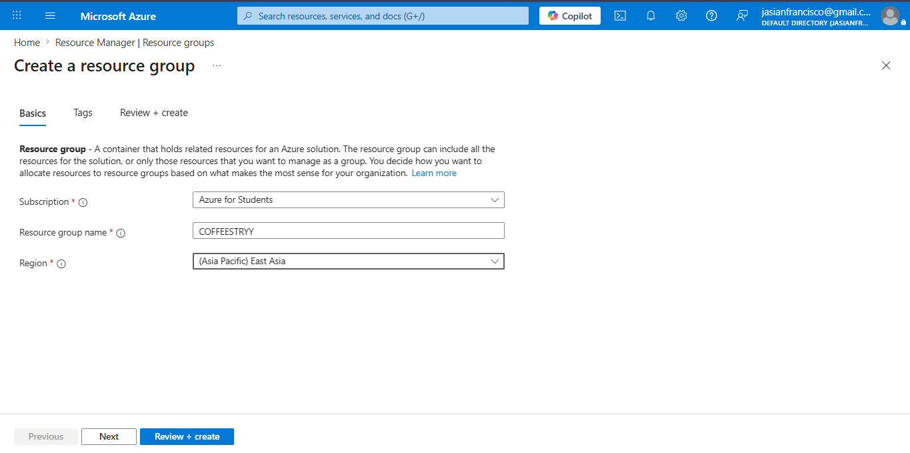
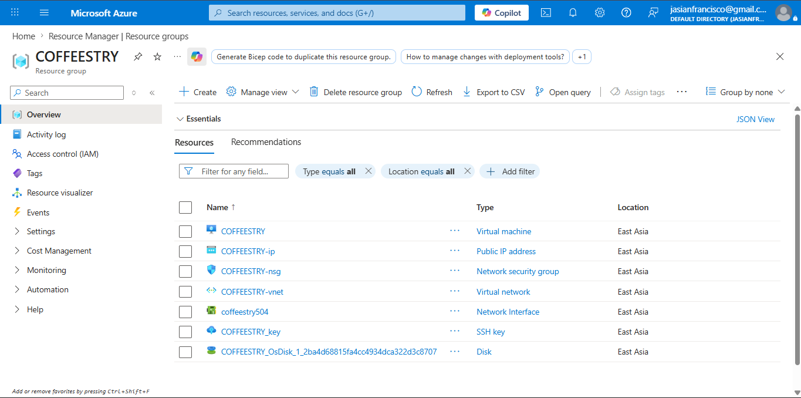
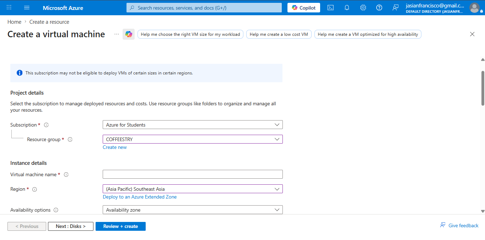
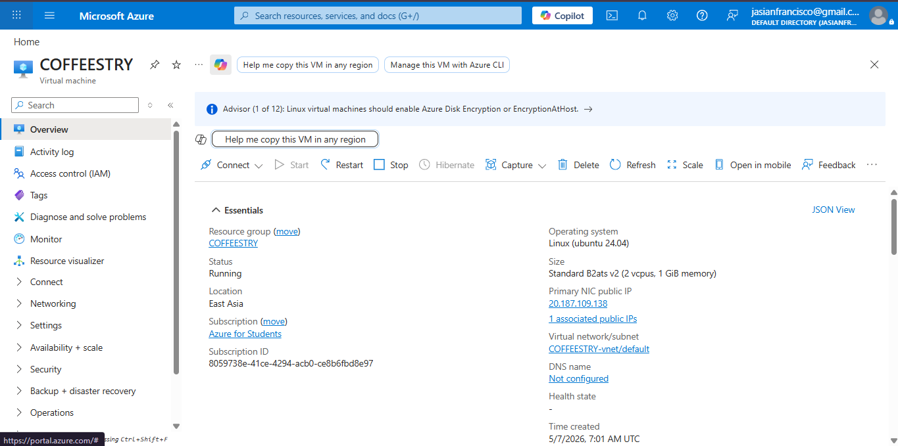
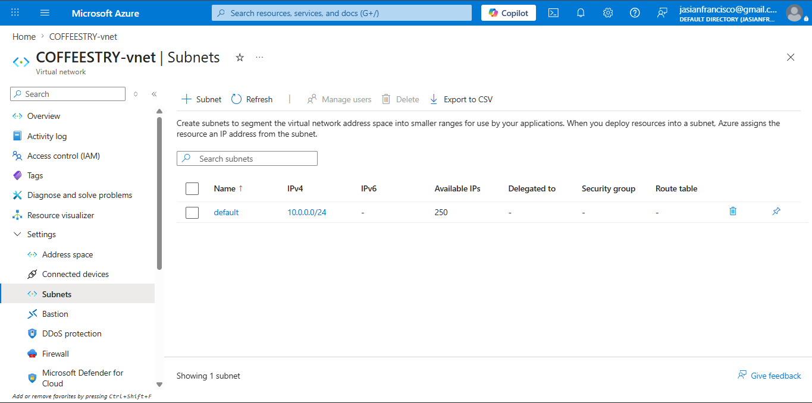
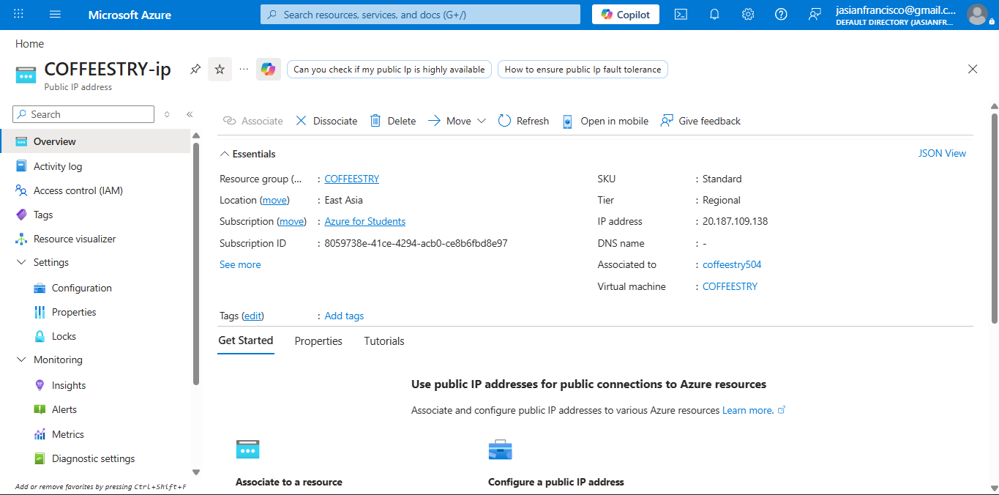
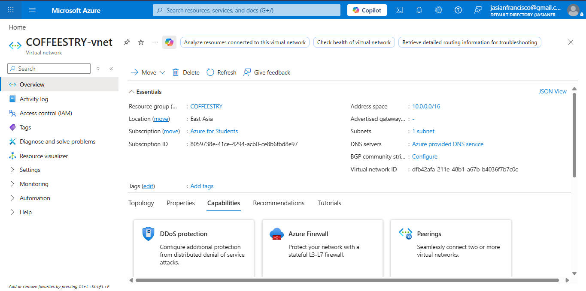

# TEAM COFFEESTRY  
## CSEC-3 Final Project – Azure Deployment Documentation  

**Members:**  
- Jasmin Francisco  
- Jenny Ibarientos  
- Janice B. Laceda  

---

# Project Overview

Coffeestry is a Python + Flet application deployed on Microsoft Azure. The system uses a lightweight cloud architecture centered around a Virtual Machine and SQLite database storage. All Azure resources are organized under a single Resource Group for simplified management, monitoring, and cost control.

---

# 1. Resource Group

The Resource Group serves as the centralized container for all Azure resources used in the project. It allows easier deployment, management, monitoring, and cost tracking of project components.

### Purpose
- Organize all resources in one location
- Simplify deployment management
- Track usage and costs
- Enable easier maintenance

### Screenshots

#### 1.1 Creating Resource Group

#### 1.2 Resource Group Overview
This page displays all deployed resources under the project. Verify that all components appear correctly after deployment.

---

# 2. Core Compute Resource — Virtual Machine

The Azure Virtual Machine (VM) serves as the primary compute resource of the Coffeestry application. It hosts and runs the Python + Flet application and provides the environment required for deployment and execution.

### Purpose
- Host the Coffeestry application
- Execute Python runtime and dependencies
- Enable remote access and management

---

## 2.1 Create Virtual Machine — Basics Tab

During setup, configure the following:

- Subscription
- Resource Group
- Virtual Machine Name
- Region
- Image
- VM Size
- Administrator Account

---

## 2.2 VM Authentication

### Configuration:
- Authentication Type: **SSH Public Key**
- Set Administrator Username
- Password login disabled

### Explanation

SSH authentication improves security by eliminating password-based access and reducing exposure to brute-force attacks.

---

## 2.3 VM Networking Configuration

Configure networking settings to allow communication between users and the deployed application.

Typical settings include:

- Virtual Network
- Public IP Address
- Network Security Group
- Open required ports

---

## 2.4 Virtual Machine Overview

After deployment, the Overview page displays:

- VM Status
- Public IP
- Resource Information
- Monitoring Details

This confirms successful deployment of the compute resource.

---

# 3. Data Resource — SQLite (Local Storage)

The application utilizes **SQLite** as its primary data storage solution. Unlike dedicated database services, SQLite operates as a self-contained file-based database embedded directly within the application.

This approach removes the need for additional Azure database services while keeping deployment simple and lightweight.

### Advantages of SQLite

- No separate database server required
- Lightweight and easy to configure
- Reduced operational complexity
- Minimal resource consumption
- Suitable for small to medium applications
- Lower deployment cost

SQLite stores data in a local database file within the Virtual Machine environment where the Coffeestry application runs.

---

# Azure Architecture Summary

| Resource | Purpose |
|-----------|----------|
| Resource Group | Organizes all deployed resources |
| Virtual Machine | Hosts and runs Coffeestry |
| SQLite | Stores application data locally |

---

# Deployment Notes

- Application deployed using Azure Virtual Machine
- Authentication configured through SSH keys
- SQLite used to eliminate additional database services
- Architecture designed for simplicity and reduced cost

---

# Team Coffeestry
CSEC-3 Final Project
