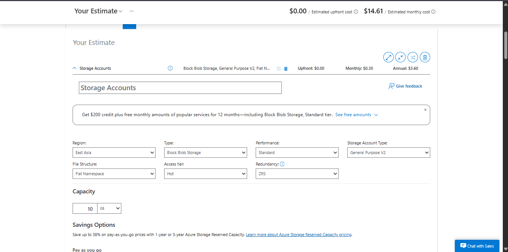

# COFFEESTRY | Azure Cost Estimate Report | CSEC-3 Final Project

JASMIN FRANCISCO | JENNY IBARRIENTOS | JANICE LACEDA | BSCS 3B

---

## 1. Architecture Summary

Coffeestry is a Python + Flet coffee shop management system deployed on an Azure Virtual Machine in the East Asia region. It serves three user roles: SuperAdmin, Admin, and Customer, and handles order management, product catalogues, and PDF receipt generation via ReportLab.

Resources

| Resource | Type | Role |
|---|---:|---|
| COFFEESTRY | Virtual Machine (Standard_B1s) | Core app host — runs Python + Flet |
| COFFEESTRY-ip | Public IP Address | Internet entry point for users |
| COFFEESTRY-nsg | Network Security Group | Security control — ports 80, 443, 22 only |
| COFFEESTRY-vnet | Virtual Network | Private network boundary |
| coffeestry504 | Network Interface | VM network adapter |
| COFFESTRY_key | SSH Key | Secure admin authentication |
| coffeestrystore504 | Storage Account (ZRS) | Data resource — file uploads |

---

## 2. Itemized Cost Breakdown

Estimates are based on the Azure Pricing Calculator (pay-as-you-go, East Asia region, May 2026). Free-tier and always-free services are marked accordingly.

| # | Resource | Type | Tier / Config | Est. Monthly Cost (USD) |
|---:|---|---|---|---:|
| 1 | COFFEESTRY VM | Virtual Machine | Standard_B1s · 1 vCPU · 1 GB RAM · Ubuntu · 730 hrs/mo | ~$10.66 |
| 2 | COFFEESTRY-ip | Public IP Address | Standard SKU · Static · 730 hrs/mo | ~$3.65 |
| 3 | COFFEESTRY-vnet | Virtual Network | Intra-region traffic · <50 GB/mo | ~$0.00 |
| 4 | COFFEESTRY-nsg | Network Security Group | No charge for NSG rules | $0.00 |
| 5 | coffeestry504 | Network Interface | No charge for NIC | $0.00 |
| 6 | coffeestrystore504 | Storage Account (ZRS) | Standard ZRS · Blob · 10 GB · East Asia | ~$0.30 |

**TOTAL ESTIMATED MONTHLY COST**

~$14.61 / month

Most of the cost comes from the VM ($10.66) and Public IP ($3.65). Storage Account (ZRS) adds $0.30/month. All networking resources fall within Azure free tiers.

---

## 3. Azure Pricing Calculator Screenshot

The following screenshot was taken from the Azure Pricing Calculator after configuring all project resources. The estimate reflects pay-as-you-go pricing in the East Asia region.

---

## 4. Cost Optimization Notes

- Auto-Shutdown During Off-Hours: Since Coffeestry is a student project and not a 24/7 production system, enabling Auto-shutdown on the VM reduces runtime from 730 hours/month to approximately 420 hours/month — a 42% reduction in compute cost. To enable: COFFEESTRY VM → Auto-shutdown (left sidebar) → Enable → set time to 10:00 PM. This saves ~ $3.60/month with zero configuration effort.
- Use reserved instances or Azure Hybrid Benefit for further savings if longer-term usage is expected.
- Use Basic/Standard IP SKU choice depending on feature needs to reduce IP cost.

---

## 5. Cost Summary

| Scenario | Est. Monthly Cost |
|---|---:|
| Current setup (pay-as-you-go) | ~ $14.61 / month |
| With reserved instance + auto-shutdown | ~ $6.80 / month |
| With Basic IP + reserved + auto-shutdown | ~ $5.00 / month |

---
